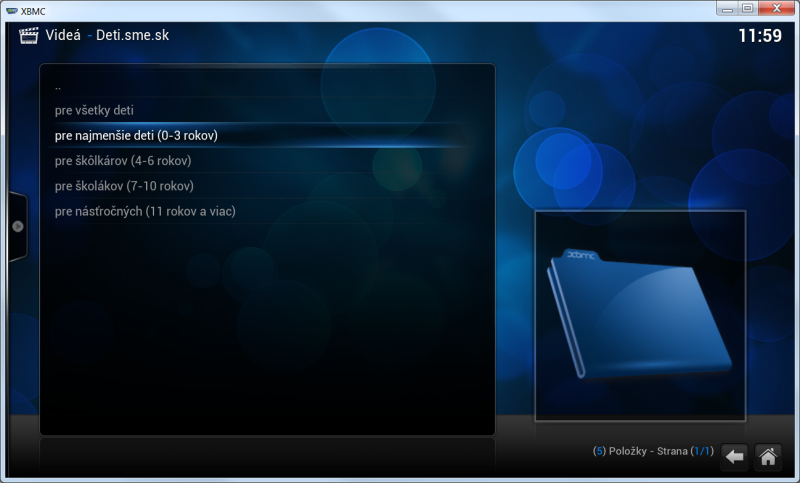
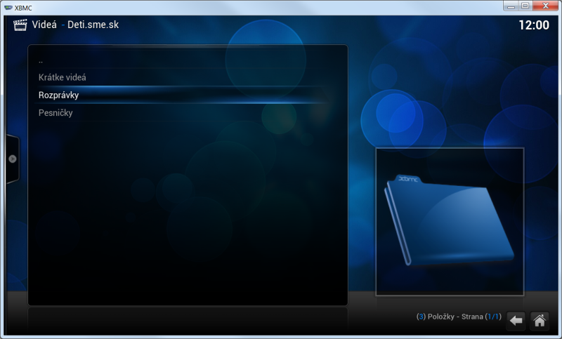
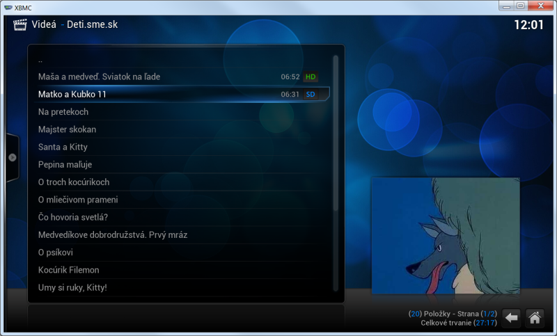

Deti.sme.sk
===========

Slovensky
---------

Plugin do XBMC pre zjednodušenie púštania rozprávok z deti.sme.sk.

- Rozdelenie obsahu podľa veku dieťaťa
- Rozdelenie na žánre: rozprávky, pesničky a krátke videá

Inštalácia
----------

1. Stiahni inštalačný zip: [v0.0.1.zip](https://github.com/n0ha/plugin.video.deti.sme.sk/archive/v0.0.1.zip)
2. V XBMC klikni na: Systém > Nastavenia > Doplnky > Inštalovať doplnky zo zip archívu
3. Nájdi stiahnutý zip súbor a potvrď

English
-------

XBMC plugin for easy access to fairy-tales from deti.sme.sk

- Select content based on child's age
- Select content based on genre: fairy-tales, songs and short videos

Installation
------------

1. Download installation zip: [v0.0.1.zip](https://github.com/n0ha/plugin.video.deti.sme.sk/archive/v0.0.1.zip)
2. In XBMC, go to: System > Settings > Addons > Install from zip file
3. Locate the downloaded zip, and confirm

Screenshots
-----------

#### Výber vekovej kategórie
 

#### Výber žánru
 

#### Výber videa
 
